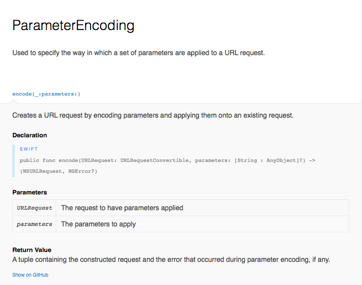
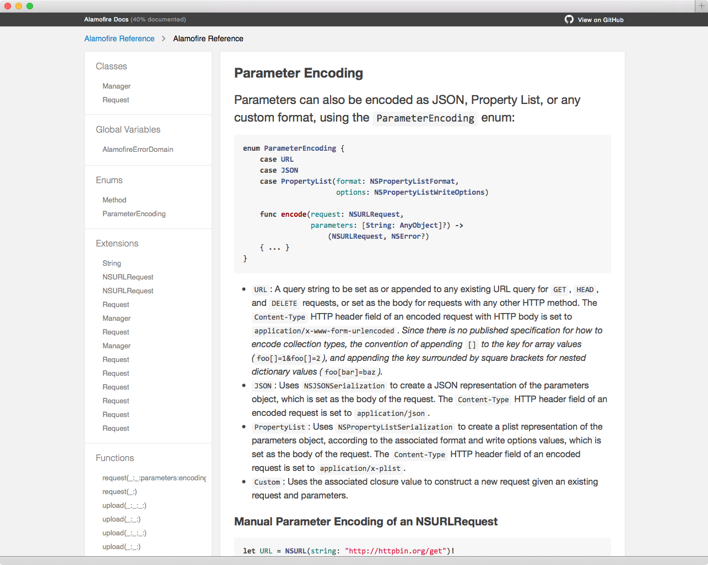
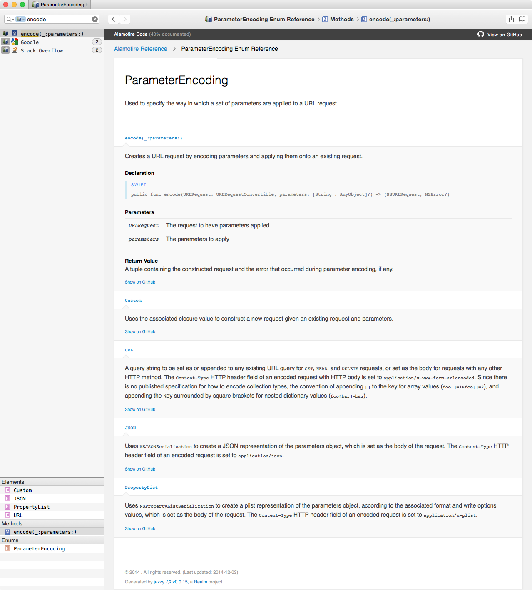

## Samuel Giddins
## @_segiddins_

---

## [fit] Thanks to _Realm_

---

### [fit] Document *__Swift__* Projects

---

## Built on _JP_’s __sourcekitten__

Leverages SourceKit for parsing

```
Usage: sourcekitten 
    [-h] 
    [--skip-xcodebuild COMPILER_ARGUMENTS]
    [--structure /absolute/path/to/file.swift]
    [--syntax /absolute/path/to/file.swift]
    [--syntax-text SWIFT_SOURCE_TEXT]
    [Xcode build arguments...]

Version: 0.1.9
```

^ All done via XPC
Reason why Swift-only now
Uses AST, super accurate

---

## Using Jazzy’s _CLI_

```
Usage: jazzy

Options
    -o, --output FOLDER              Folder to output the HTML docs to
    -c, --[no-]clean                 Delete contents of output directory before running.
                                     WARNING: If --output is set to ~/Desktop, this will delete the \
                                     ~/Desktop directory.
    -x arg1,arg2,…argN,              Arguments to forward to xcodebuild
        --xcodebuild-arguments
    -a, --author AUTHOR_NAME         Name of author to attribute in docs (i.e. Realm)
    -u, --author_url URL             Author URL of this project (i.e. http://realm.io)
    -m, --module MODULE_NAME         Name of module being documented. (i.e. RealmSwift)
    -d, --dash_url URL               URL to install docs in Dash (i.e. dash-feed://...
    -g, --github_url URL             GitHub URL of this project (i.e. \
                                     https://github.com/realm/realm-cocoa)
        --github-file-prefix PREFIX  GitHub URL file prefix of this project (i.e. \
                                     https://github.com/realm/realm-cocoa/tree/v0.87.1)
    -s FILEPATH,                     XML doc file generated from sourcekitten to parse
        --sourcekitten-sourcefile
    -v, --version                    Print version number
    -h, --help                       Print this help message
```

---

## Using Jazzy’s _CLI_

```
jazzy
    -m Alamofire
    -x -project,Alamofire.xcodeproj
    -g https://github.com/Alamofire/Alamofire
    --github-file-prefix https://github.com/Alamofire/Alamofire/blob/1.1.1
    --clean
```

---

## Swift Documentation

Like HeaderDoc, but uses ReST

See _[http://nshipster.com/swift-documentation/](http://nshipster.com/swift-documentation/)_ for reference

---

Example code from Alamofire v1.1.1

```swift
/**
    Creates a URL request by encoding parameters and applying them onto an existing request.
    
    :param: URLRequest The request to have parameters applied
    :param: parameters The parameters to apply

    :returns: A tuple containing the constructed request and the error that occurred during parameter encoding, if any.
*/
public func encode(URLRequest: URLRequestConvertible, parameters: [String: AnyObject]?) -> (NSURLRequest, NSError?) {

    // ...

}

```

---



^ Resulting HTML

---



^ README Index Pages

---



^ Dash Docsets

---

## What’s Next?

- More robust _tooling_
- Documentation generation on _CocoaDocs_
- Stronger _CocoaPods_ integration
- _Objective-C_ support
- *¯\\\_(ツ)\_/¯*

^ We want to know what features you all want, and we welcome your contributions!

---

## [fit] Samuel E. Giddins
### _Things_ at _Realm_
### @_segiddins_
